我的博客部署在 github page，有时出于一些原因，会出现不可访问的情况，同时，由于域名后缀 **github.io**有一丢丢小长。最主要还是我想搞一个自己的域名。好吧，这是重点。

so，开始购买吧。

## 1. 选择一个域名售卖商

国内可以选择腾讯云、阿里云这俩比较出名的，国外可以选择 GoDaddy、Spaceship 或者在我们下面需要用到的 CloudFlare 这几个平台。当然，还有许多可以售卖域名的平台，选一个比较出名的即可。

我这里选的是 Spaceship，我对比了几家的价格，在 Spaceship 购买 .com 后缀的域名加上优惠码首年只需 **¥39.93** 非常便宜，而后续续费一年69块。

> 需要注意的是：在购买域名时，不光要看首年价格，还要看以后续费的价格，避免以后续费时发现价格过高，只能忍痛割爱。

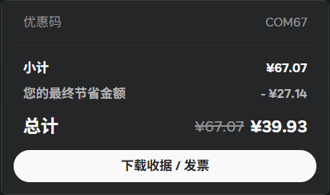

如果你正好也想买个域名，我建议可以去 [Spaceship](https://www.spaceship.com/) 看看，购买 .com 后缀域名可以使用优惠码 **COM67** 立减27块。还有一个原因就是我没有支持国际的信用卡，Spaceship 可以使用支付宝付款，这也算一个选择它的原因。

## 2.配置CDN

简单来讲，对于 github page 这种时不时就会被屏蔽一段时间的域名，访问起来很糟心，而 CDN 相当于将网站的内容缓存一份，你访问不了的网站它可以访问，然后从它那里给你返回内容。特别是对于这种静态网站，简直完美适配。

> 我突然想到如果你直接把博客部署在腾讯云的 Edge One 根本不会有这个问题，哎呀不讲不讲。

这里我们需要用到 CloudFlare 来管理我们域名的解析处理，不是因为只有他家有 CDN，而是因为他家的 CDN 不要钱。

首先，有关 DNS，当我们发送一个域名的请求，是寻找一个 DNS 服务器来解析这个域名最终指向的ip地址。

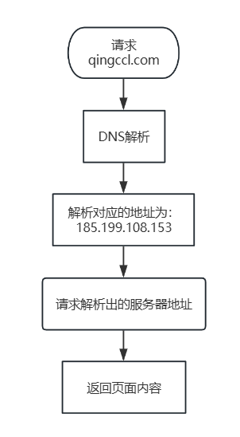

而只有控制了域名对应的解析，才能进行 CDN 的代理，接下来修改 DNS 的解析服务。

进入 **Spaceship** 点击右上角的 **Launchpad** 按钮，选择 **域名管理器**

点击连接

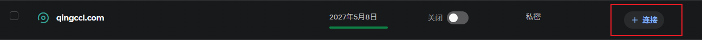

点击 **自定义名称服务器**，然后点击右下角继续按钮

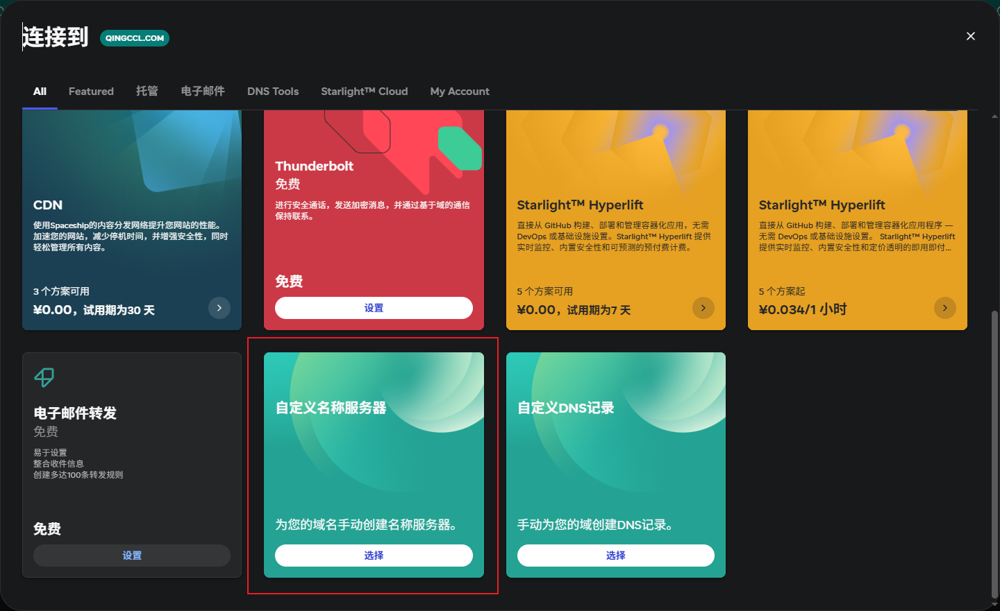

然后我们把域名解析的服务器地址设置为 CloudFlare 的域名解析服务器地址，将下面这两个填入保存即可。

johnathan.ns.cloudflare.com

sandy.ns.cloudflare.com

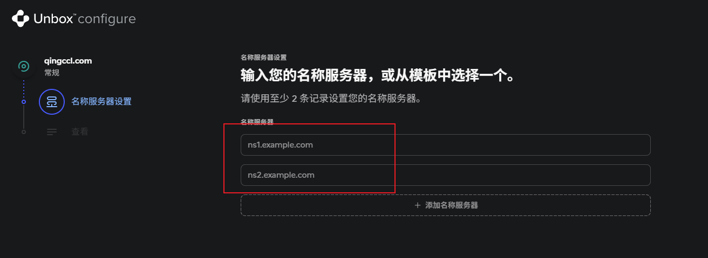

之后，我们配置 CDN ，登录 cloudflare.com，在左侧选择域名-概述页面

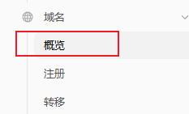

点击右上角添加域名

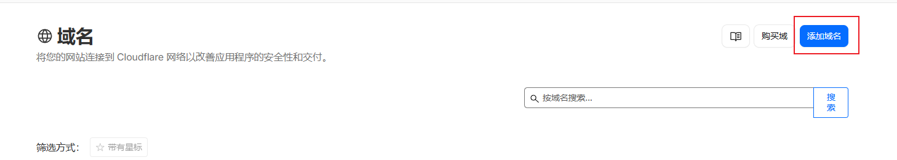

选择第一个连接域名

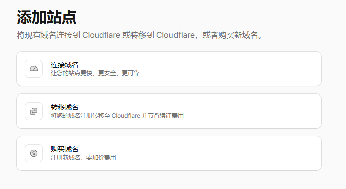

然后输入你的域名，下面配置 DNS 记录导入和 AI 爬网程序偏好设置不用管，直接继续。

可能会显示错误信息，因为修改 DNS 解析服务会有些延迟，稍等一会即可。

后面有一个需要选择计划，选那个免费的即可。默认添加域名让 Cloudflare 管理后就应该已经启用了 CDN 代理，这点我们稍后验证。

## 3.配置 DNS 解析

上面说过，DNS 是根据域名寻找对应的服务器地址，而这个地址就是需要我们自己进行配置的。

依然在 Cloudflare 左侧选择 **域名-概述** 右侧选择你的域名。

当点入后左侧列表目录会发生改变，选择左侧 DNS-记录

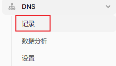

右侧照下图的进行配置，前面的qingccl.com换成你自己的域名，后面几个ipv4地址是 github page 的地址

 - 185.199.108.153
 - 185.199.110.153
 - 185.199.109.153
 - 185.199.111.153

而最后一个 CNAME 类型的记录，是为了可以使用 以 www. 的形式也能跳转到该网站上。如：www.qingccl.com

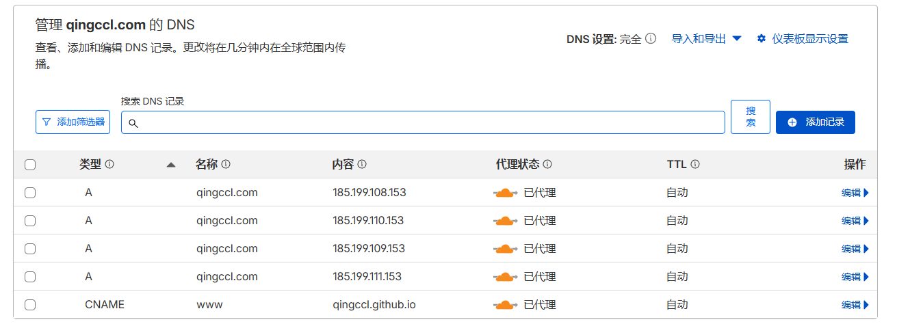

> 注意，请先把代理状态，即橙色的小云图标关闭，因为后面 github page 需要进行颁发 ssl 证书，如果没有这个证书别人访问你的网站时浏览器就会提示该网页不安全，气！有什么不安全的。

请先将所有 DNS 配置的代理状态修改为关闭，如下图所示。

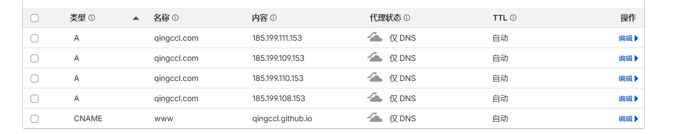

## 4.配置 github page 使用自己的域名

首先进入你博客的仓库，选择 Settings 左侧的 Pages,在 Custom domain 输入框中输入你的域名，如果前面无误的话这里应该出现 **DNS Check in Progress** 如下图所示，稍等片刻，会提示正在部署证书，等待完成后，我们开启下面的 **Enforce HTTPS** 选项。

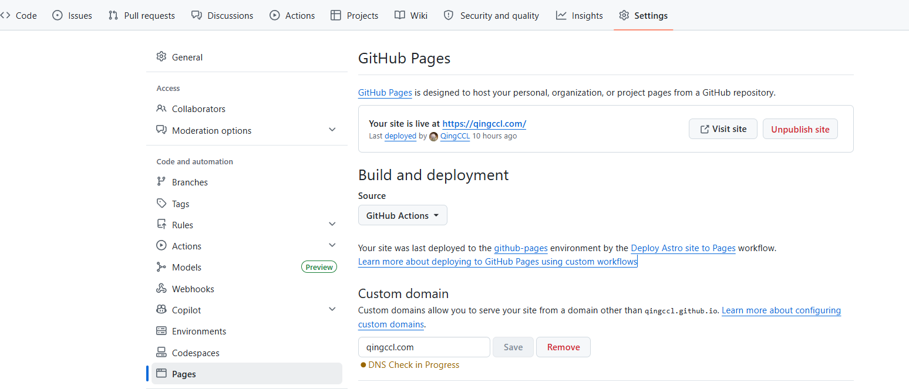

一切完成将如下图所示。

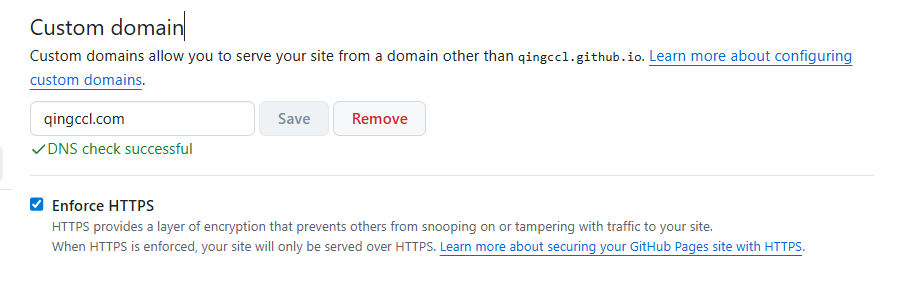

## 5.把 Cloudflare 的缓存打开

我们回到 Cloudflare 中，移动到你域名的 DNS 解析界面，将刚才关闭的代理重新打开，最后变成橙色的小云表示完成。

那么到此，你就完成了域名的购买、解析、配置 CDN 代理等操作。当然，Cloudflare 还可以查看网站访问统计等等，来都来了，顺便打开网站统计。

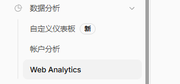

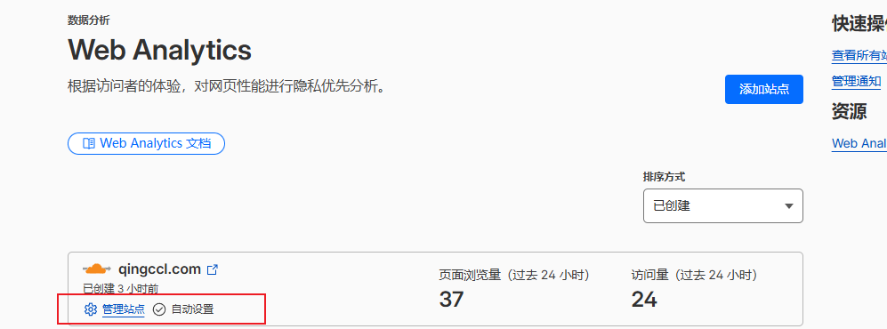

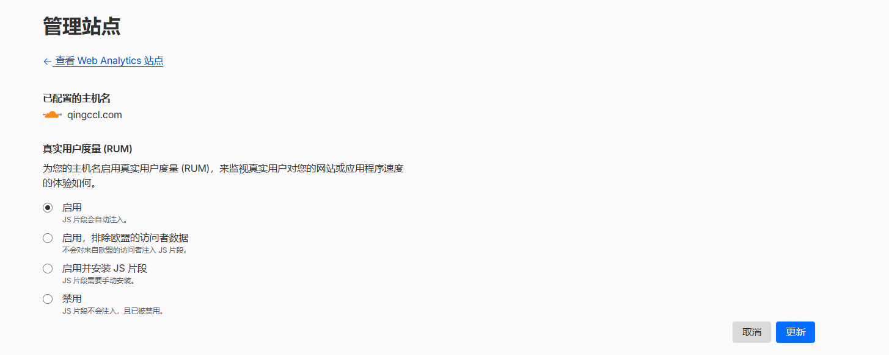

我记得默认添加域名让 Cloudflare 管理后，默认打开的，如果没有的话如图操作一下即可。

还是这个页面，在这条选项中随便点击一下即可。

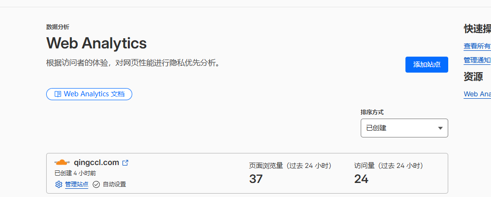

就可以看到访问的信息啦。

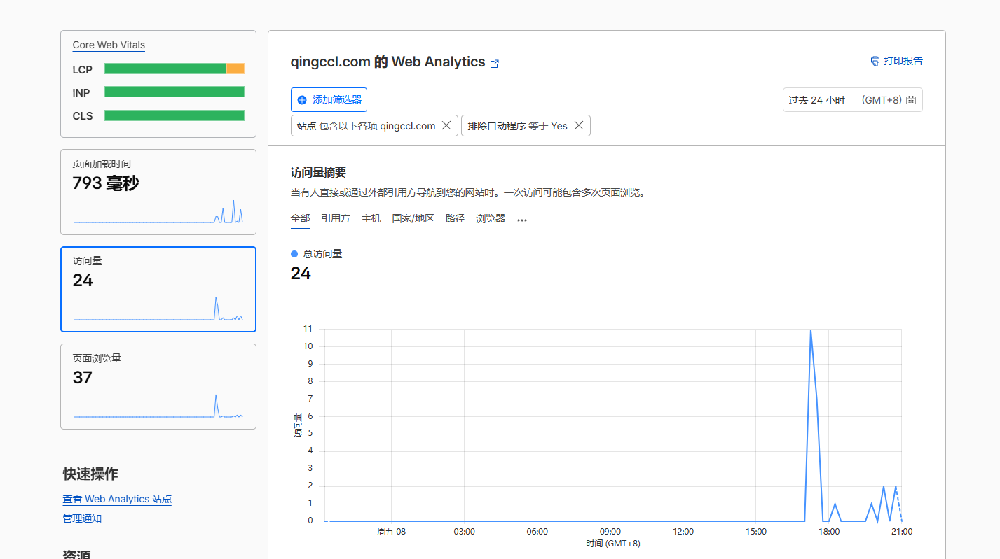

还有更多，Cloudflare 的 worker 和数据库等等，以后有机会再聊吧。

查看 Cloudflare 是否帮我们代理上了网站，我们配置这些后，稍等片刻，打开我们的网站，按下 F12 进入开发者模式，点击 NetWork 选项卡，选择左侧一个图片、css、js等静态资源，查看右侧Response headers 中 是否存在 **cf-cache-status HIT** 字段，如果存在则说明已经被代理缓存了。

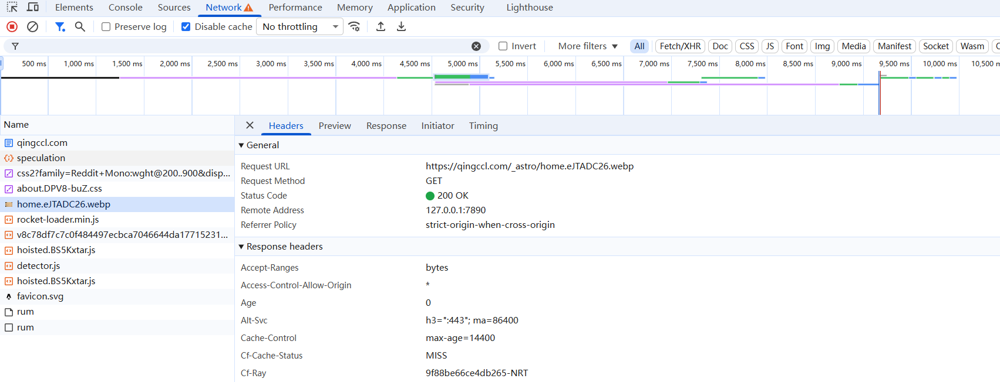

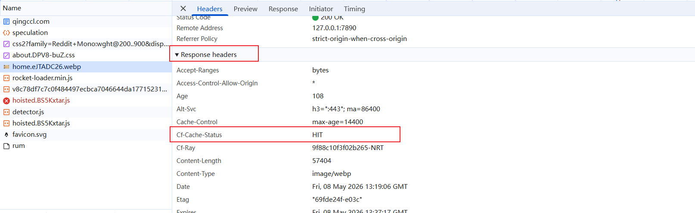

到此就完成了整个流程的配置。如果有疑问或卡住的地方，可以留言讨论讨论。

