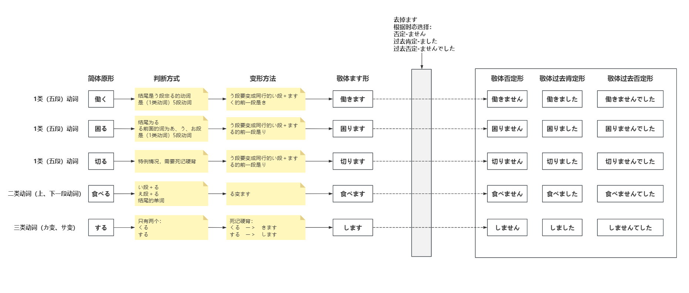

“嗯……很简单，这确实是出于一时兴起，我在读川端康成的小说时突然闪过一个想法，为什么不去学日语去读读原著呢？就像很久之前我看到过一段话：‘真羡慕你们俄罗斯人，可以用母语读陀思妥耶夫斯基的原著’。我想，或许我也可以学学日语去读川端康成的书，虽然这听起来有些天方夜谭……另外在此之前有很长一段时间我都比较迷茫，无所事事，而这也算定下了一个目标，让活着有些目的。”

“啊，是的，是的，这个过程会非常漫长且煎熬，……一时兴起是完全不能够支撑下去的，要学会变得温和下来，定下了宏伟的目标并不代表能够实现它，更不代表正在路上，要按下悸动，不要拿幻想的成果来感动自己，要脚踏实地的像登山一样，要一步步靠近，哪怕走了一毫米，也就更接近了一毫米。”

“最重要的是，我十分清楚这种劲头不出一段时间肯定就会消散。但或许等我到十年后的某一天翻开一本书、看到一段话、再次对日语产生兴趣时，不想喃喃自语道：唉，要是十年前就开始学就好了。”

# 五十音

<a href="/a.html" target="__blank">背诵</a>

## 清音

|      |     A     |        I        |       U        |    E     |      O       |
| :--: | :-------: | :-------------: |:--------------:|:--------:|:------------:|
|      | **あ**  ア |    **い**  イ    |    **う**  ウ    | **え**  エ |   **お**  オ   |
|  K   | **か**  カ |    **き**  キ    |    **く**  ク    | **け**  ケ |   **こ**  コ   |
|  S   | **さ**  サ  | **し** シ (shi) |    **す** ス     | **せ**  セ |   **そ** ソ    |
|  T   | **た**  タ | **ち** チ (chi) | **つ**  ツ (tsu) | **て**  テ |   **と**  ト   |
|  N   | **な**  ナ |    **に**  ニ    |    **ぬ**  ヌ    | **ね** ネ  |   **の**  ノ   |
|  H   | **は**  ハ |    **ひ** ヒ    | **ふ**  フ (fu)  | **へ**  ヘ |   **ほ**  ホ   |
|  M   | **ま**  マ |      **み**  ミ      |    **む**  ム    | **め**  メ |   **も**  モ   |
|  Y   | **や**  ヤ |                 |    **ゆ**  ユ    |          |   **よ**  ヨ   |
|  R   | **ら**  ラ |    **り**  リ    |    **る**  ル    | **れ**  レ |   **ろ**  ロ   |
|  W   | **わ**  ワ |                 |                |          | **を**  ヲ (o) |
|  N   | **ん**  ン |                 |                |          |              |

## 浊音

|         |  A   |    I    |    U    |  E   |  O   |
| :-----: | :--: | :-----: | :-----: | :--: | :--: |
| か行　G |  が  |   ぎ    |   ぐ    |  げ  |  ご  |
| さ行　Z |  ざ  | じ (ji) |   ず    |  ぜ  |  ぞ  |
| た行　D |  だ  | ぢ (ji) | づ (zu) |  で  |  ど  |
| は行　B |  ば  |   び    |   ぶ    |  べ  |  ぼ  |

## 半浊音

|         |  A   |  I   |  U   |  E   |  O   |
| :-----: | :--: | :--: | :--: | :--: | :--: |
| は行　P |  ぱ  |  ぴ  |  ぷ  |  ぺ  |  ぽ  |

# 长音

|      |     A     |        I        |       U        |    E     |      O       |
| :--: | :-------: | :-------------: |:--------------:|:--------:|:------------:|
|      | あ |    い    |    う    | え |   お   |
|  K   | か |    き    |    く    | け |   こ   |
|  S   | さ  | し |    す     | せ |   そ    |
|  T   | た | ち | つ | て |   と   |
|  N   | な |    に    |    ぬ    | ね  |   の   |
|  H   | は |    ひ    | ふ  | へ |   ほ   |
|  M   | ま |      み      |    む    | め |   も   |
|  Y   | や |                 |    ゆ    |          |   よ   |
|  R   | ら |    り    |    る    | れ |   ろ   |
|  W   | わ |                 |                |          | を |
|  N   | ん |                 |                |          |              |
| G | が | ぎ | ぐ | げ | ご |
| Z | ざ | じ | ず | ぜ | ぞ |
| D | だ | ぢ | づ | で | ど |
| B | ば | び | ぶ | べ | ぼ |
| P | ぱ | ぴ | ぷ | ぺ | ぽ |
| 长音符 | **あ** | **い** | **う** | **い** / **え** | **う** / **お** |

如果元行的音后面跟着对应的原音字符，则拉长该音的发音，不发元音

## あ段

おか`あ`さん　妈妈　    这个あ不发音，拉长か的发音

输入法按下两次n输入ん

## い段

おに`い`さん　哥哥  同上理

## う段

く`う`き　空气

## え段

**特殊： 加え或い**

おね`え`さん　姐姐

え`い`ご　英语

## お段

**特殊： 加お或う**

こ`お`り　`氷`这字也念 こおり　冰块

おと`う`さん　爸爸

## 片假名情况

非常简单，不分什么段，只在需要拉长的音后面加一个 **ー**   在键盘0旁边的减号键，**ー** 这个不发音，不要发汉字1的音。

ケ`ー`キ　蛋糕   cake  

コ`ー`ヒ`ー`　咖啡   coffee

ラ`ー`メン　拉面 

需注意的情况，在书写时，如果竖着写，则 `ー` 这个拉长音符也竖着写。

# 拗音

拗音只有い段，并且没有い，读法就是先读い段字加上や、ゆ、よ，连起来快读直到合并为一个音
在书写时拗音只占二分之一左右大小，再小点也行。

**长音规则：按照后面小字所在的规则段，而不是前面字，比如きゃ，添加长音就是“きゃあ”　是按照や的あ段，而不是き的い段**

**お段可以添加う或お作为长音，在拗音中，统一使用う而非お**

**另外，じゃ、じゅ 、じょ的发音与ぢゃ、ぢゅ、ぢょ相同，拗音时原则上使用じゃ、じゅ 、じょ**

| 辅音 | ゃ (ya) | ゅ (yu) | ょ (yo) |
|:---:|:---:|:---:|:---:|
| **k** | きゃ (kya) | きゅ (kyu) | きょ (kyo) |
| **s/sh** | しゃ (sha) | しゅ (shu) | しょ (sho) |
| **t/ch** | ちゃ (cha) | ちゅ (chu) | ちょ (cho) |
| **n** | にゃ (nya) | にゅ (nyu) | にょ (nyo) |
| **h** | ひゃ (hya) | ひゅ (hyu) | ひょ (hyo) |
| **m** | みゃ (mya) | みゅ (myu) | みょ (myo) |
| **r** | りゃ (rya) | りゅ (ryu) | りょ (ryo) |
| **g** | ぎゃ (gya) | ぎゅ (gyu) | ぎょ (gyo) |
| **z/j** | じゃ (ja) | じゅ (ju) | じょ (jo) |
| **d/j** | ぢゃ (ja) | ぢゅ (ju) | ぢょ (jo) |
| **b** | びゃ (bya) | びゅ (byu) | びょ (byo) |
| **p** | ぴゃ (pya) | ぴゅ (pyu) | ぴょ (pyo) |

# 促音

ltu 或 xtu　键盘输入

使用つ符号，但字符更小っ，在哪个字后面，哪个字就加重声音读并停顿

如果促音后面的音是さ行的音，那么在停顿中准备发下个音时就会自然漏气，这是正常的。

け`っ`こん 　結婚　结婚  け字重读并停顿

じ`っ`か　実家　老家 　じ字重读并停顿

は`っ`たつ　発達　发达  は字重读并停顿

あさ`っ`て　明後日　后天  さ字重读并停顿

マ`ッ`チ　match  火柴   マ字重读并停顿

き`っ`さてん　喫茶店  咖啡馆  き字重读并停顿

い`っ`しょう	　　一生   い字重读并停顿

に`っ`ぽん （にほん）　日本 	 日常常用 にほん

# 音调

两条规则：

1. 单词的第一声与第二声音调必不同
2. 一个单词的声调只会下降一次

数字标识法指的是从第几个音之后开始下降声调

## 0型

代表整个单词没有下降的地方，全部都是高音，但由于第一条规则，第一声与第二声必不同，那么第一个音就是低音

**わたし** 0型  ↓↑↑

**がくせい**  0型  ↓↑↑

## 1型

代表从第一个单词之后下降声调，那么由于第一条规则，那么第一个音就是高音，第二条规则一个单词中只会出现一次下降，那么之后的读音都是低。

**かれ**　1型 ↑↓

**しゃいん** 1型  ↑↓

**まさか**　1型 ↑↓↓

## 2型

代表从第二个单词之后下降声调，那么由于第一条规则，那么第一个音就是高音，第二个音低音。然后第二条规则一个单词中只会出现一次下降，那么之后的读音都是低。

**あなた** 2型 ↓↑↓

**あのひと** 2型  ↓↑↓↓

无论多少型都按照这个规则就能知道读音了。

# 第一课

**语法书选择的《新版中日交流标准语第三版》**

## 单词

|     单词     |   假名   |  声调  |  含义  |
| :----------: | :----: | :------: | :----------: |
| 中国人 |  ちゅうごくじん  | 4 | 中国人 |
| 日本人 | にほんじん | 4 | 日本人 |
| 韓国人 | かんこくじん | 4 | 韩国人 |
| アメリカ人 | あめりかじん | 4 | 美国人 |
| フランス人 | ふらんすじん | 4 | 法国人 |
|    学生    |   がくせい   |     0     |     学生     |
| 留学生 | りゅうがくせい | 3 | 留学生 |
| 教授 |   きょうじゅ   | 0 | 教授 |
| 社員 |    しゃいん    | 1 | 职员 |
| 会社員 |  かいしゃいん  | 3 | 公司职员 |
| 店員 |    てんいん    | 0 | 店员 |
| 研修生 | けんしゅうせい | 3 | 进修生 |
| 企業 |    きぎょう    | 1 | 企业 |
| 大学 |    だいがく    | 0 | 大学 |
| 父 |      ちち      | 1、2 | 父亲 |
|    私    |    わたし    | 0 |   我   |
|   貴方 *较少使用汉字   |      あなた      | 2 |     你     |
| あの人 | あのひと | 2 |   那个人   |
| 彼 | かれ | 1 |     他     |
| 彼女 | かのじょ | １ |     她     |
| ～さん、君 |  ～さん、くん  |  | 先生、小姐 |
|     森     |     もり     |      |   森（姓氏   |
| 田中 | たなか |  | 田中（姓氏 |
| 小野 | おの |  | 小野（姓氏 |
| 金 | キム |  | 金（姓氏 |
| 吉田 | よしだ | | 吉田（姓氏 |
| 森 | もり | 0 | 森（姓氏 |

## 肯定句

A`は`B`です`

は在句子做助词，表示前面的是主题，读音为「わ」

> 私`は`　中国人`です`　我是中国人

> 私`は`　学生`です`　　我是学生

## 否定句

A`は`B `では`　`ありません`　

は同样读わ的音，在口语中，では　ありません有时会读作じゃ　ありません，じゃ是偏口语的表达，而では更正式的表达。

> 森さん`は`学生`ではありません`　森先生不是学生

> わたし`は`にほんじん`ではありません`  我不是日本人

> わたし`は`田中`じゃ`ありません　我不是田中    

## 疑问句

A`は`Ｂ`ですか。`

相当于中文的A是B吗？助词`か`在结尾表疑问，日语疑问句不加问号。回答可以只使用`はい`或`いいえ`

> あなた`は`小野さん`ですか`。  你是小野女士吗？
>
> はい，小野です。   是的，我是小野。

> キムさん`は`中国人`ですか`。 金女士是中国人吗？
>
> いいえ、中国人ではありません。  不，不是中国人。

回答时不想重复问句，可以说：

> あなたは小野さんですか。  你是小野女士吗？
>
> はい、そうです。　是的，我就是。
>
> いいえ、ちがいます。　不，不是。

**还有两点，除了疑问外，根据か的声调不同还区分为：是进一步确认，还是理解了对方所说的内容**

>鈴木：森さんですか。
>
>吉田：いいえ、私は吉田です。
>
>鈴木：あっ、吉田ですか。はじめまして。

>鈴木：森先生吗？
>
>吉田：不是，我是吉田。
>
>鈴木：啊，是吉田先生啊。初次见面。

在对话中，第一句中的 `鈴木：森さんですか。` 这是疑问

而第三句的  鈴木：あっ、`吉田ですか`。はじめまして。这里`か`的声调应该是下降 ，类似`啊，是这样啊`，表示理解了对方所说的内容。

> 地図【ちず】はどこですか。
>
> 地図ですか、ここです。

> 地图在哪里？
>
> 地图吗？在这里。

第一句是询问地图在哪里，第二句的`地図ですか`最后这个`か`的声调是上升的，表示确认对方所询问的内容。

## も
助词も的意思是“也”，功能和は一样，也是表示主题，所以句子中不需要原本的は

> 佐藤【さとう】：私は学生です。鈴木【すずき】さん`も`学生ですか。
>
> 佐藤：我是学生，铃木小姐也是学生吗？
>
> 
>
> 鈴木：はい、私`も`学生です。高橋【たかはし】さん`も`学生ですか。
>
> 铃木：是的，我也是学生，高桥先生也是学生吗？
>
> 
>
> 高橋：私は学生じゃあれません。田中【たなか】さんは？
>
> 高桥：我不是学生，田中小姐呢？
>
> 
>
> 田中：私`も`学生じゃあれません。
>
> 田中：我也不是学生。

## あなた

在不知道对方姓名而且又必须招呼时，才会使用第二人称あなた，因为用あなた来称呼对方，有时会显得很不礼貌。

## ～さん

称呼别人时，不分男女都在其姓名后加さん。xx先生/女士。自己不用加さん

另外，对于与自己年龄相当，或比自己年轻的男性，有时也用“君（くん）”称呼

## 省略

> `[あなたは]`吉田さんですか。
>
> （你是）吉田先生吗？

> いいえ、`[私は]`吉田じゃありません。`[私は]`森です。
>
> 不，（我）不是吉田，（我）是森。

## 惊叹

あっ是吃惊或有所感触时发出的声音。

（在人群中发现了森）あっ！森さん！

人们在紧急情况下一般情不自禁地发出“あっ”，自言自语时也会使用。

（不小心碰到别人）あっ、すみません。  啊，对不起。

## 寒暄语

願读音 　ねが

自我介绍时，在说完自己的姓名或公司名称后，接着说：“どうぞ　よろしく　お願いします。”相当于汉语中的“请多关照”

はじめまして、鈴木です。どうぞ　よろしく　お願いします。　

初次见面，我是铃木，请多多关照。

`こちらこそ`、どうぞ　よろしく　お願いします。

我才要请你多多关照

こちらこそ 我才要……，（请多多关照）这话该我来说才对

# 第二课

## 单词

|   单词   |   假名   | 声调 |    含义    |
| :------: | :------: | :--: |:--------:|
|    本    |   ほん   |  1   |    书     |
|  かばん  |  かばん  |  0   |  包，公文包   |
|  ノート  |  のーと  |  1   |   笔记本    |
|   鉛筆   | えんぴつ |  0   |    铅笔    |
|    傘    |   かさ   |  1   |    伞     |
|    靴    |   くつ   |  2   |    靴子    |
|   新聞   | しんぶん |  0   |    报纸    |
|   雑誌   |  ざっし  |  0   |    杂志    |
|   辞書   |  じしょ  |  1   |    词典    |
|  カメラ  |  かめら  |  1   |   照相机    |
|  テレビ  |  てれび  |  1   |   电视机    |
| パソコン | ぱそこん |  0   |   个人电脑   |
|  ラジオ  |  らじお  |  1   |   收音机    |
|   電話   |  でんわ  |  0   |    电话    |
|    机    |  つくえ  |  0   |  桌子，书桌   |
|   椅子   |   いす   |  0   |    椅子    |
|    鍵    |   かぎ   |  2   |    钥匙    |
|   時計   |  とけい  |  0   |   钟，表    |
|   手帳   | てちょう |  0   |   记事本    |
| スマホ | すまお |      | 智能手机 |
| トイレ |  | 1 | 洗手间 |
| 受付 | うけつけ | 0 | 柜台、前台 |
|   これ／それ／あれ／どれ   |      |  0／0／0／1  |   这~／那~／那~／哪~   |
|   この／その／あの／どの   |      | 0／0／0／1 |   这个~／那个~／那个~／哪个~   |
|   ここ／そこ／あそこ／どこ   |      | 0／0／0／1 |   这里／那里／那里／哪里   |
|   こちら   |      | 0 |   这（个、里、位）   |
| そちら |  | 0 | 那（个、里、位） |
| あちら |  | 0 | 那（个、里、位） |
| どちら |  | 1 | 哪（个、里、位） |
|    何    |   なん   |  1   |    什么    |
|    誰    |   だれ   |  1   |    谁     |
|  どなた  |  どなた  |  1   |    哪位    |

## これ／それ／あれ

1. 讲话者和聆听者相隔一段距离，面对面时。

- これ 距离`讲话者`较近的事物【讲话者的范围、领域内的事物】
- それ 距离`聆听者`较近的事物【讲话者的范围、领域内的事物】
- あれ 距离双方都比较远的事物【不属于任何一方的范围、领域内的事物】

2. 说话人和听话人位于同一位置，面向同一方向时

- これ 距离两人`较近`的事物
- それ 距离两人`较远`的事物
- あれ 距离两人`更远`的事物

> これは私のかばんです。あれも私の[かばん]です。
>
> 这个是我的包，那个也是我的（包）

>これは私の手帳じゃありません
>
>这个不是我的记事本。

## 誰ですか／何ですか

不知道是什么人用`誰`

不知道是什么事物用`何`

> `それ`は`何`ですか 
>
> 那是什么？

>`あの`人は`誰`ですか。
>
>那个人是谁？

`だれ`比较礼貌的说法是`どなた`

だれ通常用于对方与自己地位相当或比自己地位低时。对尊长或比自己地位高的人用`どなた`询问

## の

**一般情况下**相当于汉语的“的”

助词用于连接名词与名词，所属、所有、所在、所产。

> 私は貿易がい会社`の`社員です
>
> 我是贸易公司的员工

>  私は筑波大学`の`学生です。
>
>  我是筑波大学的学生

> あなたはバナスニック`の`社員ですか。
>
> 你是松下电器的职员吗？

>あの人は東京大学`の`学生じゃあぃません。
>
>那个人不是东京大学的学生。

>これは私`の`ノートパソコンです。　
>
>这是我的笔记本电脑

## この／その／あの
> `この`カメラはスミスさんの[カメラ]です。
> 
> 这个相机是史密斯先生的。

> `その`自転車【じてんじゃ】は森さんの[自転車]です
> 
> 那辆自行车是森先生的。

>`あの`ノートはだれの[ノート]ですか。
> 
> 那个笔记本是谁的？

**一般需要省略掉后面重复询问的名词。**

## どれ／*どの
どれ和どの是在`三个`以上的事物中，不能确定哪一个的时候使用的`疑问词`。单独使用时，用どれ，修饰名词时，用どの。

> 森さんのかばんはどれですか。
> 
> 森先生的包是哪个？

> 長島【ながしま】さんの傘はどれですか。
> 
> 长岛先生的伞是哪一把？

> 小野さんの机【つくえ】はどの机ですか。
> 
> 小野女士的桌子是哪一张？
> 
> 也可以替换为どれ：小野さんの机はどれですか。

关于最后一个小野的例子，我询问ai这两种语法差异，很小。

>「どの机」：特意重复，有“聚焦”和“排他”的语感
> 
>明知主题是桌子，还故意再说一遍“桌子”，在语言上是一种冗余强调。它会产生这样的额外效果：
>
>“就是问桌子，别看别的”
> 
>比如房间里有桌子、椅子、书堆，虽然你问的是“小野的桌子”，但对方可能分神。你重复「どの机」，就像在说：“我特指桌子这个类别里的哪一张，不要理会旁边的椅子。”
>
>“在众多同类（桌子）中，具体指出一个”
> 
>重复名词有一种“指认仪式感”，仿佛在说：“这一大堆桌子里，到底哪一张才是呢？”

最后它给我了一个直观的类比，如中文里：

“小野的桌子是哪张？”

“小野的桌子是哪张桌子？”

这两句中文，我也很难说出它们之间微妙的差异。so，对于实在理解不了的内容，就不要去理解它，而是去感受它。

## 指示词的种类

|          |       指东西       | 指东西（后面要接名词 |      指地方      |  指东西、地方、人（有礼貌的说法  |
| :------: | :----------------: | :------------------: | :--------------: | :------------------------------: |
| 靠近自己 | これ 这（个） |   この~ 这个~   |  ここ 这里  | こちら 这（个）、这里、这位 |
| 靠近对方 | それ 那（个） |   その~ 那个~   |  そこ 那里  | そちら 那（个）、那里、那位 |
|   远方   | あれ 那（个） |   あの~ 那个~   | あそこ 那里 | あちら 那（个）、那里、那位 |
|  疑问词  | どれ 哪（个） |   どの~ 哪个~   |  どこ 哪里  | どちら 哪（个）、哪里、哪位 |

`どれ`和`どの`是在`三个以上`的事物中，不能确定哪一个的时候使用的`疑问词`。

而`どちら`也用于`二选一`时的哪一个。

## 方——礼貌

读音`かた`

在日语里，对于长辈、上司等应该尊敬的对象，或初次见面的人以及交往不多的人，一般使用礼貌语言。

`この方`　`その方`　`どの方` 替换`この人`　`その人`　`あの人` 即成为一种礼貌语言。

>この人は鈴木です。
>
>这个人是铃木。

>この方は鈴木さんです。
>
>这位是铃木先生。

另外，如下两句话，听起来会觉得对人不尊敬。

> jc企画の人ですか。 
>
> 是jc策划公司的人吗？

>日本人ですか。
>
>是日本人吗？

修改使用下面这种，听起来比较礼貌。

> jc企画の方ですか

>日本の方ですか

## 询问年龄——礼貌

询问年龄时，用`何歳【なんさい】ですか (多大了？)` 或`おいくつですか （多大年纪了）` 无论年龄多大都可以用。

不过在询问孩子时，通常使用`いくつ`或`何歳`。

## どうぞ

用于给对方物品，或劝对方进餐。

> これは中国【ちゅうごく】の名産品【めいさんひん】です。`どうぞ`。
>
> 这是中国有名的特产，请收下。

>どうも　ありがとう　ございます。
>
>太感谢了。

## 叹词

### えっ

对对方说的话感到吃惊或意外时使用。

> あの方は田中先生【せんせい】です。
>
> 那位是田中老师。
>
> ―えっ。
>
> 啊？（以为田中老师是学生，因此很吃惊）

另外，也可以用于没明白对方意思时反问。但要注意，重复使用会让人觉得不礼貌。

> 私はJC企画【きかく】の社員【しゃいん】です。
>
> 我是JC策划公司的员工。
>
> ーえっ。（没听懂哪个公司）
>
> 啊？
>
> JC企画の社員です。
>
> JC策划公司的员工。

### わあ

感动或吃惊时发出的声音。

> わあ、シルクのハンカチです。
>
> 哇，是真丝手绢啊。

## はい和ええ

ええ是はい比较随便的说法，但只能用于肯定对方的疑问。在别人叫自己名字应答时，必须用はい而不能用ええ。

## どうぞ	ありがとう　ございます——寒暄语

`どうぞ`是用来加强`ありがとう　ございます`所表示的谢意。但是，在略表谢意时，可以省略`ありがとう　ございます`,只使用`どうぞ`

## 错误内容与思考

### 1.

> どちらは鈴木さんですか。

我想表达哪位是铃木先生或铃木先生在哪里。但上面那句语法是错误的。

**注意**，は的前面必须是已知主题，不能直接用疑问词作主题，正确语法如下：

> 鈴木さんはどちらですか。

但比如前面的

> これは何ですか。

这句语法中的`これ`并不是疑问词，而是代词，已经明确知道、看见了一个东西，但不清楚它的名字、作用等，これ代指它，而不是不知道这件东西。

### 2.

在新标日第二版，该节课后的练习题，回复句为：`はい、あれは鈴木さんの車です。` 填写疑问句。

这里想到两个疑问句：

> あれは鈴木さんの車ですか。 
>
> 那是铃木先生的车吗？

> あの車は鈴木さんのですか。
>
> 那辆车是铃木先生的吗？

这两句在中文中也能体现出区别：第一句不确定那个东西是什么，而第二句已经确定了是车，而不确定是谁的车，侧重点稍微不同。

# 第三课

## 单词

|     单词     |        假名        | 声调 |      含义      |
| :----------: | :----------------: | :--: | :------------: |
|   デパート   |      でぱーと      |  2   |    百货商店    |
|     食堂     |     しょくどう     |  0   |      食堂      |
|    郵便局    |   ゆうびんきょく   |  3   |     邮政局     |
|     銀行     |      ぎんこう      |  0   |      银行      |
|    図書館    |     としょかん     |  2   |     图书馆     |
|  マンション  |     まんしょん     |  1   |  （高级）公寓  |
|    ホテル    |       ほてる       |  1   |      宾馆      |
|   コンビニ   |      こんびに      |  0   |     便利店     |
|    喫茶店    |     きっさてん     |  0   |     咖啡馆     |
|     病院     |     びょういん     |  0   |      医院      |
|     本屋     |       ほんや       |  1   |      书店      |
|  レストラン  |     れすとらん     |  1   |  餐馆、西餐馆  |
|     ビル     |        びる        |  1   |   大楼、大厦   |
|     建物     |      たてもの      |  2   |  大楼、建筑物  |
|    売り場    |       うりば       |  0   |  柜台、出售处  |
|    トイレ    |       といれ       |  1   |      厕所      |
|    入り口    |      いりぐち      |  0   |      入口      |
|    事務所    |      じむしょ      |  2   |     事务所     |
|     受付     |      うけつけ      |  0   |     接待处     |
| バーゲン会場 | ばーげんかいじょう |  5   | 降价处理大卖场 |

> トイレはどこですか。
>
> 厕所在哪里？
>
> あちらです。
>
> 在那边。

>ここは郵便局【ゆうびんきょく】ですか。銀行【ぎんこう】ですか。
>
>这里是邮局还是银行？
>
>銀行です。
>
>是银行。

>これはいくらですか。
>
>这个多少钱？
>
>それは5800円【えん】です。
>
>那个5800日元。
>
>あれは？
>
>那个呢？
>
>あれも5800円。
>
>那个也是5800日元。

## ここ／そこ／あそこ

`ここ／そこ／あそこ`は`名`です。

指场所时，用`ここ` `そこ` `あそこ` 所表示的位置关系与`これ` `それ` `あれ` 相同。

**注意，这里的意思仅仅是说，离说话人近的用ここ、これ，远的用そこ、それ，更远的用あそこ、あれ，而不是说当指示场所时这两种词可以互相替换使用。**

**これ、それ、あれ是指示一个具体的物体，而ここ、そこ、あそこ是指示一个空间范围。**

另外还有一点，由于中文惯性，反正对于我自己来说，比如描述地点，”哪有超市？“我可能会回答：“那是超市。”其实隐含含义是“那（里）是超市。”

那么这种惯性带到日语中便是`それはデパートです。` 但正确的应该是`そこはデパートです。`这点需要注意。

这里ai说了一种情况

> 当你指着百货商店的**大楼外观**时，严格来说它属于“物体”，但日本人**通常还是会说**：
>
> ここはデパートです。

但只要看他最终想问、想回答的是物体本身、还是物体所在的空间信息，然后选对应的词语即可。

>ここはデパートです。
>
>这里是百货商店。

>そこは図書館【としょかん】です。
>
>那里是图书馆。

>あそこは入口【いりぐち】です。
>
>那里是入口。

## 名は名[场所]です

表示名存在于名[场所]。

> 食堂【しょくどう】はデパートの七【なな】階【かい】です。
>
> 食堂在商场的7层。

> トイレはここです。
>
> 厕所在这里。

> 小野さんは事務所【じむしょ】です。
>
> 小野先生在事务所。

### 存疑

有关最后一个小野的例子。は所表达的意思不仅仅只有“是”，但这种句型`人は场所です`。用来表达某人在某处应该是有上下文或特定情况，这点不太清楚，等学学了再回头来看看。

另外，`ここはトイレです。`和`トイレはここです。`这两句基本意思一样，这里是厕所，厕所在这里。只是语感有些许差异。

## どこ

询问存在的场所

> トイレは`どこ`ですか。
>
> 洗手间在哪里？
>
> トイレはここです。
>
> 洗手间在这里。

> 受付はここですか。
>
> 柜台在这里吗？
>
> はい、そうです、こちらです。
>
> 是的，没错，柜台在这里。

> 教室はどちらですか。
>
> 教室在哪里呢？
>
> 教室はそちらです。
>
> 教室在那里。

## 名は　名ですか、名ですか

多个答案而询问其中一种时。不能用`はい`或`いいえ`回答，这点和中文相通，逻辑一样的。

> 厕所在一层还是二层？  
>
> ——是的。
>
> ？？？

>  かばん売【う】り場【ば】は　1【いっ】階【かい】ですか、2【に】階ですか。
>
> 卖包的柜台在一层还是二层？

这个ですか可以一直往后叠，不过超过两三个就很显得累赘了。

> 林【はやし】さんは　韓国人ですか、　日本人ですか、中国人ですか。
>
> 林先生是韩国人、还是日本人、还是中国人呢

ai说，当选项超过两个时，前面的选项通常只保留**名词+升调**，只在**最后一个选项**后面加「ですか」。这样句子节奏明快，干净利落。

在最后一个选项前添加`それとも` 这里的「それとも」专门用于连接最后两个选项，表示“或者”，能让听者明确知道“问题要结束了”。这样更地道。

> 林さんは **韓国人、日本人、それとも中国人ですか**。
> （林先生是韩国人、日本人，还是中国人呢？）*

## 名は　いくらですか

问价格。  `おいくらですか`更礼貌。

> これはいくらですか。
>
> 这个多少钱？

> その靴はおいくらですか。
>
> 那个靴子多少钱？

## 省略

这点与中文相通。

> これはおいくらですか。
>
> ［それは］700円【えん】です。
>
> それは［おいくらですか］？
>
> これも700円です。

> 这个多少钱？
>
> ［那个］700日元。
>
> 那个［多少钱］呢？
>
> 这个也是700日元。

## 来自哪个国家/公司

询问来自哪个国家，一般用`国【くに】は　どちらです。` 或更礼貌的 `お国は　どちらです。`

询问公司 `会社は　どちらです`　有两个含义（你的公司在哪里？/ 你是哪个公司的？）一种是询问公司所在地，一种是询问所属公司名称，这点需要根据上下文判断。

> 甲：会社は　どちらです。
>
> 乙：1.上海【シャンハイ】です。
>
> 乙：2.JC企画です。

## あのう——搭话

用于引起别人注意。另外在说到难以启齿的事情、开始一个新话题以及向别人提出请求时，也可以使用。

看看番就知道了。

> すみません、あのう，ABC大学【だいがく】はどちらですか。
>
> 打扰一下，请问ABC大学在哪里？

# 第四课

## 名[场所]に　名[物/人] が　あります／います

表示~有~。

`あります` 用于花、草、桌子等不具有意志的事物。

> 部屋【へや】`に`机【つくえ】`が` **`あります`**。
>
> 房间里有桌子。

> ここ`に`本【ほん】`が` **`あります`**。
>
> 这里有书。

> 庭【にわ】`に`何【なん】`が` **`ありますか`**。
>
> 院子里有什么？

`います`用于有意志的人、动物、昆虫。

> 部屋`に`猫【ねこ】`が` **`います`**。
>
> 房间里有一只猫。

> 公園【こうえん】`に` 子供【こども】`が` **`います`**。
>
> 公园里有小孩。

> あそこ`に`だれ`が` **`いますか`**。
>
> 谁在哪儿？

## 名[物/人]は　名[场所]に　あります／います

あります和います使用方式同上。

あります

> 椅子`は`部屋【へや】`に`　**`あります`**。
>
> 椅子在房间里。

> 本`は`ここ`に` **`あります`**。
>
> 书在这里。

> 図書館【としょかん】`は`どこ`に` **`ありますか`**。
>
> 图书馆在哪儿？

います

> 吉田【よしだ】さん`は`庭`に` **`います`**。
>
> 吉田先生在院子里。

>子供【こども】`は`公園【こうえん】`に` **`います`**。
>
>孩子在公园。

> 犬`は`どこ`に` **`いますか`**。
>
> 狗在哪？

在第三节课中`～は　とこですか`这个句型也可以使用`～は　とこに　あります／います`来表示。

> 小野さんの家`はどこですか。
>
> 小野さんの家`は`どこ`に`ありますか。
>
> 小野女士的家在哪里？

> 林さんはどこですか。
>
> 林さん`は`どこ`に`いますか。
>
> 林先生在哪里？

> 森さんはここです。
>
> 森さん`は`ここ`に`います。
>
> 森先生在这里。

## と

助词`と`加在两个名词之间表示并列，相当于汉语的“和”

>  時計【とけい】`と`眼鏡【めがね】
>
> 表和眼镜

>ビール`と`ウイスキー
>
>啤酒和威士忌

## 上／下／前／後ろ／隣／中／外

表示位置时，使用名词+の+上【うえ】／下【した】／前【まえ】／後【うし】ろ／隣【となり】／中【なか】／外【そと】。

> 机【つくえ】の上に猫【ねこ】がいます。
>
> 桌子上有只猫。

> 会社【かいしゃ】の隣に花屋【はなや】があります。
>
> 公司旁边有花店。

> 猫は箱【はこ】の中にいます。
>
> 猫在箱子里。

> 売店【ばいてん】は駅【えき】の外にあります。
>
> 小卖铺在车站外边。

`本は机にあります`和`本は机の上にあります`的区别`

这两个句子的核心区别在于**位置描述的精确度**。

> 本は机にあります

字面意思：书在桌子那里。只说明了书位于“桌子”这个空间范围内，但没有指明具体在桌子的哪个方位。书可能在桌面上、在抽屉里、在桌子底下，或者挂在桌子旁边（视具体语境而定）。虽然日本人日常默认多半指“桌面上”，但严格语法上它只表示“存在于此区域内”。

> 本は机の上にあります

字面意思：书在桌子的上面。通过助词「の」连接「机」和「上」，精准地指出书位于桌子的上表面（桌面上）。排除了抽屉里、桌子底下等其他位置，明确表示接触桌面的上方。

日语中的“上”能表示的范围比汉语的“上”窄，只表示垂直上方的范围，汉语的墙上表示的是墙壁表面，而日语的壁【かべ】の上意思是墙壁上方的天棚，而不是墙壁表面。

> 正确的：壁にスイッチがあります
>
> 错误的：壁の上にスイッチがあります。
>
> 墙上有开关。

## ね

当说话人就某事征求听话人的同意时，句尾用助词`ね`，读升调。

> あそこに犬【いぬ】がいますね。
>
> 那有一只狗吧？

> この新聞【しんぶん】は林【はやし】さんのですね。
>
> 这个报纸是林先生的吧？

> 駅【えき】の前【まえ】に銀行【ぎんこう】がありますね。
>
> 车站前面有家银行吧？

## 疑问词+も+动[否定]

表示全面否定。

>  教室【きょうしつ】にだれも　いません。
>
> 教室里谁都没有

>冷蔵庫【れいぞう】に何【なん】も　ありません。
>
>冰箱里什么都没有

## ええと

类似在思考回复时下意识说出的“嗯……”

>  森さん、私の本はどちらですか。
>
> 森先生，我的书在哪里/我的书是哪一本？
>
> ええと、ここです。
>
> 嗯……在这里/这本。

## ご家族、ご兄弟、ご両親——礼貌

ご家【か】族【ぞく】（家人），ご兄【きょう】弟【だい】（兄弟姐妹），ご両親【りょうしん】（父母） 是说到别人亲属时的礼貌说法。

在会话中使用“ご家族”来指对方的家人，而用“家族”来指自己的家人。

## 兄弟

兄弟【きょうだい】指同一父母的人，也用于仅是同父同母的情况。但不仅仅指男性兄弟之间，兄妹、姐弟、姐妹也称“きょうだい”

## 一人暮らし

离开家人一个人生活称作一人暮らし【ひとりぐらし】

## 课后文章

1

> （小李一边打开地图册一边问）
>
> 李：小野さん、会社はどこにありますか。
>
> 李：小野女士，公司在哪里？
> 这句话也可以替换为最开始学的：小野さん、会社はどこですか。

> 小野：（翻看一下地图册）ええと、ここです。
>
> 小野：嗯……在这里。
> 这里隐含动作就是小野给李在地图上指了具体的位置。

> 李：近【ちか】くに駅【えき】がありますか。
>
> 李：附近有车站吗？

> 小野：ええ。JRと地下鉄【ちかてつ】の駅があります。
>
> （指着地图册）JRの駅はここです。
>
> 小野：嗯，有JR和地铁的车站。
>
> JR的车站在这里。

>李：地下鉄の駅はここですね。
>
>地铁的车站是这里吧？隐含指地图的动作。

>小野：ええ、そうです。JRの駅の隣に地下鉄の駅があります。
>
>嗯，对的，JR车站的旁边就是地铁的车站。

2

> (小李询问小野的家庭情况)
>
> 李：小野さんの家はどちらですか。
>
> どちら含义有哪个、哪里、哪位，是比どこ更有礼貌的问法，结合上下文此处李询问的是小野女士的家在哪里。

> 小野：私の家は横浜【よこはま】です。
>
> 小野：我的家在横滨。

> 李：ご家族も横浜ですか。
>
> 李：你家人也在横滨吗？

> 小野：いいえ、私は一人暮らしです。
>
> 小野：不是的，我自己一个人住。

> 李：ご両親はどちらですか。
>
> 李：你的父母[住]在哪里？
>
> 结合上下文是在询问家庭住所。

> 小野：両親は名古屋【なごや】にいます。
>
> 小野：我的父母在名古屋。

> 李：ご兄弟は？
>
> 李：你的兄弟姐妹呢？
>
> 省略句，ご兄弟は[どこ/どちらにいますか。]

> 小野：大阪【おおさか】に妹【いもうと】がいます。
>
> 小野：大阪有个妹妹。
>
> 看追求直译还是意译了，因为他用的是xxにxxが  什么地方有什么东西这个语法，直译就是大阪有个妹妹，或者意译，有个妹妹在大阪，结合上下文，李不是在问小野有没有兄弟姐妹，而是在问兄弟姐妹在哪里，那么后者更符合汉语表达习惯

# 动词——简变敬

> 动词分为简体与敬体（ます形）以及其他体，后面再学。同一词的简、敬体意思相同，只不过敬体更有礼貌。它们都有不同变化形式以表达不同的时态。敬体的变化有：`ます／ません／ました／ませんでした`这四个基本的变化形态，而简体有另一套稍复杂的变化规则。但无论简、敬体或其他体，所有的变化都是由简体的辞书形（基本形）而来。
>
> 同时，简体动词变敬体动词也有一套规则，下面学的就是简变敬的规则。

动词三分类

1.所有动词原型都是以`う`段结尾

## 一类动词（五段动词）

1. **结尾是`う`段非`る`的动词，肯定是5段动词**
   
    - 書く　かく　 
    - 探す　さがす 
    - 勝つ　かつ
    - 遊ぶ　あそぶ
    - 読む　よむ
    
2. **あ、う、お段+る**

    看结尾る前面的词是否为あ、う、お段。

    - 困る　こまる
    - 怒る　おこる
    - やる

3. **特例**

    - 切る　きる　切
    - 帰る　かえる　回家
    - 走る　はしる　跑

## 二类动词（上一段动词、下一段动词）

い段＋る和え段＋る结尾的单词

おきる

たべる

みえる

おしえる

うける

## 三类动词（カ变、サ变）

くる

する

## 变ます形

### 1类动词

う段要变成同行的い段＋ます

書く　かく　ー＞　書きます

吸う　すう　ー＞　吸います

切る　きる　ー＞　切ります

呼ぶ　よぶ　ー＞　呼びます　

### 2类动词

る变ます

教える　おしえる　ー＞　教えます

開ける　あける　ー＞　開けます

調べる　しらべる　ー＞　調べます

得る　える　ー＞　得ます

### 3类动词

死记硬背

来る　ー＞　来ます　　くる　ー＞　きます

する　ー＞　します

# 第五课

## 今 ～時　～分です

表示现在的时间时，常用`今【いま】～時【じ】　～分【ふん】です`。双方都明确在讲现在的时间时，可以省略`今`。询问具体时间时使用`何【なん】時【じ】`

> 今4【よ】時です。
>
> 现在是4点。

> 今何時ですか。
>
> 现在几点？
>
> 8【はち】時30分【さんじゅっぶん】です。
>
> 8点30分。

30分可以使用`半【はん】`代替，有时表示具体时间的词前面还可以加上`午前【ごぜん】`或`	午後【ごご】`

> 今午前8【はち】時半です。

## ます／ません／ました／ませんでした

肯定的叙述现在以及将来的习惯性动作、状态时，使用`～ます`，否定形式为`～ません`。过去的肯定为`～ました`、否定形式为`～ませんでした`。这四种都是礼貌的表达形式。

> 森さんは毎日【まいにち】働【はたら】き`ます`。
> 森先生每天工作。

> 田中さんは明日【あした】休【やす】み`ます`。
> 田中先生明天休息。

> 田中さん今日【きょう】働き`ません`。
> 田中先生今天不工作。

> 森さんは明日休み`ません`
> 森先生每天不休息。

> 森さんは先週【せんしゅう】休み`ました`。
> 森先生上周休息。

> 私は昨日【きのう】働き`ませんでした`。 
> 我昨天没上班。

疑问句在结尾加`か`

> 田中さんは明日働き`ますか。`
> 田中先生明天上班吗？

>李さんは先週休み`ましたか`。
> 小李上周休息了吗

## 名[时间] に 动

表示动作发生的时间，在具体时间词语后加上助词`に`

> 森さんは七【しち】時【じ】`に`起【お】きます。
>
> 森先生七点起床

> 学校【がっこう】は八【はち】時半【はん】始【はじ】まります。
>
> 学校八点半开始上课。

叙述包含数字的时间时后续助词`に`，要说成：

- 3月【さんがつ】14日【じゅうよっか】に
- 2008【にせんはち】年【ねん】に

但 

- 今【いま】
- 昨日【きのう】
- 今日【きょう】
- 明日【あした】
- 毎日【まいにち】
- 去年【きょねん】
- 来年【らいねん】

等词后不能加に。星期后一般加に，如日曜【にちよう】日【び】に，但也可以不加。

> 　私は明日休【やす】みます。
>
> 　私は明日`に`休みます。  错误的句子，不能加に

## 名[时间] から 名[时间] まで 动

表示某动作发生在某个**期间**时，用`～から　～まで。`

> 私は9【く】時`から`5【ご】時`まで`働き`ます`。
>
> 我9点到5点工作。

> 森さんは月曜日【げつようび】`から`水曜日【すいようび】`まで`休【やす】み`ました`。
>
> 森先生星期一到星期三休息了。

注意，第二句之所以有`了`因为句子最后`ます`是过去时态的`ました。`

から和まで可以单独使用，如下。

> 私は9時から働きます。
>
> 我从9点开始工作。

> 森さんは2【に】時勉強【べんきょう】します。
>
> 森先生学习到2两点。

## 错误内容与思考

### 1.

在上面的`森さんは月曜日から`水曜日まで`休み`ました。这句话我只是看了一眼中文翻译就开始写日语，最后的ました写成了ます，然后对教材上的翻译感到困惑，为什么第二句是过去时，最后发现原句结尾是ました。

除了上个错误外，这里还有一点容易混淆的地方，虽然知道不对，但我却总感觉ます、ました、ません、ませんでした这些就像语法组成结构的は、に等等，如森先生这个例子，我在该例句中标记的是`ました`而非`休みました`，但实际上这些结尾部分是动词的ます形变化，而非语法结构。

### 2.

第二条说了から和まで可以单独使用，我看到翻译后直接去写日语，依旧写错了。

> 私はから勉強します。

忘记了在前面加上具体的指示词语。这里问了ai，无论单独或组合使用から、まで，它们前面必须接一个名词。所含意思如下所举：

- 表示日期时间：从xx时候开始、到xx结束。　
  - 9時から10時まで。从9点到10点。
  - 月曜日から。从星期1开始。
- 表示地点场所：从xx出发，到xx。　
  - 北京から東京まで。从北京出发抵达东京。
  - ここからそこまで。从这里到那里。
- 表示数字数量与范围：从x开始，到x　
  - 1から10まで。从1到10.
  - 100円から。从100日元起。
- 表示人物身份或事物：从x开始，到x 　
  - 私から。从我开始。

组合使用就是规定了整个范围，单独则只规定起点/终点。

## いつ 动 ますか

询问某动作或事态进行的时间用`いつ`，询问的时间很具体时，在表示时间的词语后面添加`に`，如`何時に`、`何曜日【なんようび】に`、`何日【にち】に`。另外在句尾添加`か`，变成`ますか`的形式。

> 試験【しけん】はいつ始【はじ】まりますか。
>
> 考试什么时候开始？

> 仕事【しごと】は何時に終わりますか。
>
> 工作几点结束？

这里ます是动词现在/将来肯定形式，那么也可以换成过去时

> 試験はいつはじまりましたか。
>
> 考试什么时候开始的？隐含意思就是已经开始考试了。或者更加明确是过去的事情：
>
> 昨日の試験はいつ始まりましたか。
>
> 昨天的考试什么时候开始的？

对于`昨日の試験はいつ始まりましたか。`ai说有问题，语法正确但逻辑不自然，因为「昨日の試験」已经限定了是“昨天的”考试。用「いつ」（什么时候）提问，通常是在完全不知道日期的情况下问“哪一天”。既然你已经知道是“昨天”了，再问“什么时候开始的”，这时候询问的具体时间点应该是“几点几分”，而不是“哪一天”。

想了想确实，这点中文也同理，只是中文“什么时候”隐含了”几点“所表达的意思，比如，"昨天你什么时候去的北京"和"你什么时候去北京"，这两句话中的“什么时候”所询问的时间范围是不一样的，前者问的是昨天的具体时间，隐含等同于“昨天你几点去的北京"，而后者询问的是哪一天，但中文的“什么时候”隐含了“几点？上午还是下午？”的意思，并不区分模糊范围——类似日语中的`いつ`与精确范围——如：`何時に`、`何曜日に`、`何日に`。所以在日语中，当前文已经确定了具体日期范围，那么后者询问的范围应当小于前面已经确定的范围。

应该改为如下：

> 昨日の試験は何時に始まりましたか。
>
> 昨天的考试几点开始的。

询问持续性动作或时态的起点或终点时，使用`いつから`、`何曜日まで`等。

> 展覧会【てんらんかい】はいつから始【 はじ】まりますか。
>
> 展会什么时候开始。

> 張さんは何曜日【なんようび】まで休【やす】みますか。
>
> 火曜日【かようび】までです。
>
> 张先生休息到周几？
>
> 休息到周二。

这里有个疑问，这个语法与上个`いつ`、`何時／何日……に`的区别：

举个例子，先看后面的`何曜日に`与`何曜日まで`的区别

> 張さんは何曜日まで休みますか。
>
> 张先生休息到周几？

> 張さんは何曜日に休みますか。
>
> 张先生周几休息？

这个比较容易理解，因为本质含义不同。前者是问休息的开始时间，后者是询问休息的结束时间。

而`いつ`与`いつから`的区别我问ai，叽里咕噜的术语讲得我似懂非懂，后来我想到一个解释给了ai，如下：

>我能不能这样理解，假设我们无论哪种都使用いつ，但如果在开始后的一段时间内，依然反复触发开始的判断条件，则使用いつから。
>
>比如考试，当发卷子后，就不会再重复发了，那么这件事就是いつ、而比如进入考试周，每天都还会再次触发这个开始的判断，就使用いつから。
>
> 再比如你说的下雨和进入梅雨季的例子，第一颗雨点落下的一刻，我们定义为下雨了，而后面落下的雨都不能再定义为刚开始下雨，所以用いつ，而梅雨季可能会反复的下雨和雨停，那么每天都重新触发了下雨的这个判断条件，所以也使用いつから。

ai说对，但有一种情况，它给我补充了一下：

> 比如“暑假”。暑假并不会“每天重复触发‘放假’的开关”。但暑假是一个持续不变的漫长状态。在这种“不重复，但持续”的情况下，依然要用「いつから」，所以,**只要这个“开始”之后，不是单纯地等着结束，而是进入了某种“持续期”或“反复触发期”，都用「いつから」；只有“开始了就结束了（瞬间切换）”才用「いつ」。**

## は——对比

は除了可以当提示主题的助词外，还可以表示对比，对比时，`は`要略微发重一些

> 小野さんは今日【きょう】`は`休【やす】みます。
>
> 小野女士今天休息。

- 「今日**は**」→ **表示对比**（需要重读）。
  - **潜台词**：今天休息，**但是（昨天/明天/其他日子）可能不休息**，或者**别人不休息，但她今天休息**。
  - 这里的「は」排除了“其他时间”，把焦点锁定在“今天”。

> 森さんは毎朝【まいあさ】何時に起きますか。
>
> 森先生，你每天早晨几点起床？
>
> いつもは7【しち】時ごろです。
>
> 我一般是7点起床。

- 「いつも**は**」→ **表示对比**（需要重读）。
  - **潜台词**：**平时/一般情况**是7点起床，**但（今天/昨天/特殊情况）就不是这个点了**。
  - 这里隐含了“例外情况”的存在，暗示听话人“我现在说的是通常规则，不是绝对”。

## 人称——在工作单位

在公司称呼上司时，一般可以直接称呼其职务，如`課長【かちょう】`如`吉田【よしだ】課長【かちょう】`，有的地方也有直接姓名：`吉田さん`

>甲是科长，乙是其部下
>
>甲：遅刻【ちこく】ですね。
>
>甲：迟到了吧。
>
>乙：すみません、課長。
>
>乙：对比起，科长。

如果谈及对方单位的人，或与别的公司的科长或总经理交谈时，一般要在其职务后再加`さん`以表敬意。

>課長さん、お宅【たく】は　どちらですか。
>
>科长，您家住哪里？
>
>神戸【こうべ】です。
>
>我住神户。

## ～です

部分已经明确的内容，回答时不需要重复。

> 北京【ペキン】支社【ししゃ】は何時に始まりますか。
>
> 北京分公司几点上班？
>
> [北京支社は] 8【はち】時です。
>
> （北京分公司）8点上班。

## 毎朝　何時に　起きますか

当两个名称都表示时间，而前面的名词中包含“每”时，两个名字之间不加の，当前的不包含时，可以加也可以不加。

> 森さんは毎日【まいにち】7時【しちじ】に起きます。
>
> 森先生每天7点起床。

> 森さんは来週【らいしゅう】日曜日【にちようび】働きます。
>
> 森先生下星期天工作。
>
> 或：森さんは来週`の`日曜日働きます。

## ごろ

ごろ接在表示时间的词语后面，如`～分【ふん】`,`～時【じ】`,`～日【にち】`,`～曜日【ようび】`,`～月【がつ】`,`～年【ねん】`,等，表示大致的时间范围。``后面一般不加`に`。

> 昨日【きのう】12【じゅうに】時半【はん】`ごろ`寝ました。
>
> 昨天12点半左右睡觉。

如果去掉`ごろ`，那么就需要加`に`

> 昨日12時半`に`寝ました。

## 课后文章

1

>吉田【よしだ】：小野さん、李さんの歓迎会【かんげいかい】はいつですか。
>
>吉田：小野先生，李小姐的欢迎会是什么时候？
>
>小野：明後日【あさって】の夜【よる】です
>
>小野：后天晚上。
>
>吉田：何時からですか。
>
>吉田：几点开始？
>
>小野：6【ろく】時からです。
>
>小野：6点开始。

2

> （森悄悄走进办公室）
>
> 吉田：森さん、おはよう。今何時ですか。
>
> 吉田：小森早上好，现在几点了？
>
> 森：10【じゅう】時15【じゅうご】分【ふん】です。
>
> 森：10点15了。
>
> 吉田：遅刻【ちこく】ですね。
>
> 吉田：迟到了噢。
>
> 森：すみません、課長。【かちょう】
>
> 今朝【けさ】9【く】時に起きました。
>
> 森：对不起，科长。
>
> 今天早上9点起的。

3

> 李：森さんは毎朝【まいあさ】何時に起きますか。
>
> 李：森先生每天早上几点起床？
>
> 森：いつもは7【しち】時ごろです。李さんは？
>
> 森：一般7点左右，李先生呢？
>
> 李：私は6【ろく】時ごろです。
>
> 李：我一般6点左右。
>
> 森：北京支社【ししゃ】は何時に始【はじ】まりますか。
>
> 森：北京分公司几点开始上班？
>
> 李：8【はち】時です。午前【ごぜん】8時から午後【ごご】5【ご】時まで働【はたら】きます。
>
> 李：8点，工作时间从上午8点到下午5点。
>
> 森：土曜日【どようび】は？
>
> 森：星期六呢？
>
> 李：土曜日は働きません。土曜日と日曜日【にちようび】は休【やす】みます。
>
> 李：周六不上班，周六和周日休息。

# 第六课

## 名[场所] へ 动

使用`行きます`,`帰ります`等表示移动的动词时，移动行为的目的地用助词`へ`表示，**这时`へ`读作`え`**

> 吉田さんは中国【ちゅうごく】`へ`行きます。
>
> 吉田先生去中国。

> 森さんは日本【にほん】`へ`帰ります。
>
> 森先生回日本。

> 李さんはどこ`へ`行きますか。
>
> 小李去哪了？

## 名[ 场所] から 动

使用移动动词时，移动的起点用助词`から`表示，这也是在第5课中的表示时间起点的那个`から`

> 李さんは先月【せんげつ】北京【パキン】から来【き】ました
>
> 小李上个月从北京来。

> あの方【かた】はどこから来ましたか。
>
> 那个人是从哪来的？

## 名[人] と 动

共同做某事的对象用助词`と`表示

> 小野さんは友達【ともだち】と帰りました。
>
> 小野先生和他朋友一起回去了。

> 李さんは誰【だれ】と日本へきましたか。
>
> 小李和谁一起来的日本？

## 名[交通工具] で 动

交通手段使用助词`で`表示，不使用交通工具步行则用：`歩【ある】いて`

> 日本まで`飛行機【ひこうき】で`行きます。
>
> 坐飞机去日本。

> 私は`バスで`家【いえ】へ帰ります。
>
> 我坐公交车回家。

> 李さんは`歩いて`アパートヘ帰りました。
>
> 小李步行回的公寓。

> 京都【きょうと】へ何できましたか。
>
> 怎么来的京都？

## 名[场所] から 名[场所]まで 名[动]

表示移动的范围时，起点用`から`，终点用`まで`

> 森さんは東京【とうきょう】から広島【ひろしま】まで新幹線【しんかんせん】で行きます。
>
> 森先生从东京坐新干线到广岛。

> 李さんは　駅【えき】からアパートまで歩いて帰りました。
>
> 小李从车站走回公寓。

## 思考

> 李さんは誰と飛行機で北京から日本へ来ましたか。
>
> 小李和谁一起从北京坐飞机来的日本？

这句话基本包含了前面所学的`へ`，`から`，`と`，`で`

询问ai是否存在某种规则，比如先目的后手段然后是同伴之类的，ai说没有，可以随便排列语法都正确，但不同排列侧重的重点不同，那也就是说，有24种排列组合，但听起来最自然顺序的还是：

- `と`表同伴  `で`表手段  `から`表起点 `へ`表终点
- `で`表手段  `と`表同伴  `から`表起点 `へ`表终点

比如中文的：小李和谁一起从北京坐飞机来的日本？换成：小李来日本坐飞机和谁一起从北京？倒也能听懂，但很奇怪。

另外，`へ`与`まで`的区别：

1. 使用「へ」（に / へ）—— 侧重“到达点 / 目的地”

- 语感：这是一个非常标准、中性的问法。助词「へ」表示动作的方向和最终到达的地点。
- 含义：问的是“目的地是日本”，重点在于“日本”这个落脚点。
- 回答逻辑：对方只需要回答“和谁一起”，不需要刻意考虑移动的过程。

2. 使用「まで」—— 侧重“移动的跨度 / 距离感”

- 语感：「まで」表示时间和空间的终点界限，常与「から」搭配（~から～まで）。
- 含义：这句话强调了“从北京到日本”这段物理距离。给人的感觉是“大老远从北京一路坐飞机来到日本”。
- 潜台词：说话人强调了路途的遥远或行程的完整性。因为「来ました」表示“来到（说话人所在处）”，所以说话人现在就在日本，并且潜意识里觉得“北京到日本可不近”。
- 回答逻辑：虽然问的还是“和谁”，但在语境中，听话人往往会感觉到说话人在意“远道而来”这件事。

因为这两个助词都有标明目的地的功能，当都表示目的地时，不能同时使用。

## に／で／へ／かあ／まで／と +  は

在第五课中，助词`は`有表示对比的意思，`は`可以单独使用也可以加在`に`，`で`，`へ`，`から`，`まで`,`と`的后面构成一种符合形式。

> 私の部屋【へや】`には`電話【でんわ】がありません。
>
> 我的房间里没有电话。

这句话是隐含对比：其他房间大概率有电话，一种暗示。

而如果修改为：`私の部屋に`電話がありません。` 那就只是陈述一个事实，没有上面那种隐含含义。

>  韓国【かんこく】`へは`行きます。中国【ちゅうごく】`へは`行きませんでした。
>
> 我去了韩国，没有去中国。

而这句话就是明确的对比，去了韩国而非中国。

## たしか

`たしか～`表示不完全把握的记忆，“凭记忆应该是~”的意思

> あの人は誰ですか。
>
> 那个人是谁？

> たしか李さんの会社の人です。
>
> 我记得是小李他们公司的人。

这里的记忆程度比较高，只是不能100%确定，所以不要理解为，“好像“、“可能”等词语，因为这类词语更多包含了推测而非记忆本身。

## ～です。

依然还是省略功能，替代动词叙述。

> 森さんは何で帰りますか。
>
> 森先生怎么回去呢？

> バスでかえります。
>
> 坐公交车回去

> バスです。
>
> 坐公交车。

第二句其实还省略了`私は`。

## 家／うち

两者意思都是（我）家，但`家【いえ】`一般指的是建筑物，`うち`着重指家人，另外`うち`本身就代表“我家”，而使用`家`时必须说`私の家`

> 私の家はここです。
>
> 我家在这里。

> スミスさんの家にはプールがあります。
>
> 史密斯先生家里有泳池。

这句中`には`是`に`+`は`用作对比，隐含意思别人家里可能没有。

> （私の）うちには子供【こども】がいません。
>
> 我家没有孩子。

这句同上句，也是隐含用自己家与别人家对比，一般家庭都会有孩子而自己家没有。

## まっすぐ　かえりました

`まっすぐ`本身就表示“笔直”，而与`帰ります`组合时表示“不顺路去别处，径直”的意思。

> 今日はまっすぐ帰ります。
>
>  今天直接回家。

## それ

除了第二课中学习的代指眼前的物品外，也可以代指事物。

在课后文章中介绍。

## お疲れさまでした——寒暄

同伴之间体谅，安慰对方使用的词语。也可以在公司使用，下班先离开的人说：`お先【さき】に失礼【しつれい】します。`（我先走了），留下的人则说：`お疲【 つか】 れさまでした`向工作一整天的同事道声辛苦。

## 课后文章

1.

> 吉田：李さん、昨日【きのう】は何時にアパートへ帰【かえ】りましたか。
>
> 吉田：小李，昨天几点回的公寓？
>
> 李：ええと、たしか11【じゅういちじ】時半ごろです。
>
> 小李：嗯……我记得没错的话是11点半左右。
>
> 吉田：何で帰りましたか。タクシーですか。
>
> 吉田：怎么回去的？坐出租车吗？
>
> 李：電車【でんしゃ】です。渋谷【しぶや】まで電車で行きました。駅【えき】からアパートまで歩【ある】いて帰りました。
>
> 李：坐的电车，坐电车到涩谷，从车站走回的公寓。
>
> 吉田：小野さんは？
>
> 吉田：小野呢？
>
> 小野：私も電車です。駅からはタクシーでうちへ帰りました。
>
> 小野：我也是坐的电车，从车站出来坐出租车回家。
>
> 李：何時に帰りましたか。
>
> 李：几点回的家？
>
> 小野：12【じゅうに】時ごろです。
>
> 小野：12点左右。

2.

> 小野向正在打瞌睡的森搭话。
>
> 小野：森さん、ゆうべはまっすぐ帰りましたか。
>
> 小野：森先生，昨晚直接回家了吗？
>
> 森：いいえ、課長【かちょう】といっしょに銀座【ぎんざ】へ行【い】きました。
>
> 森：没有，我和科长一起去了银座。
>
> 李：えっ、銀座ですか？
>
> 李：啊，银座吗？
>
> 小野：何時にうちへ帰りましたか。
>
> 小野：几点回家的？
>
> 森：夜中の2【に】時です。
>
> 森：夜里两点。
>
> 小野：2時ですか。`それ`はお疲れ様でした。
>
> 小野：啊，两点吗？那真是辛苦了。

这里的`それ`指的就是前文中工作到两点这件事情。

